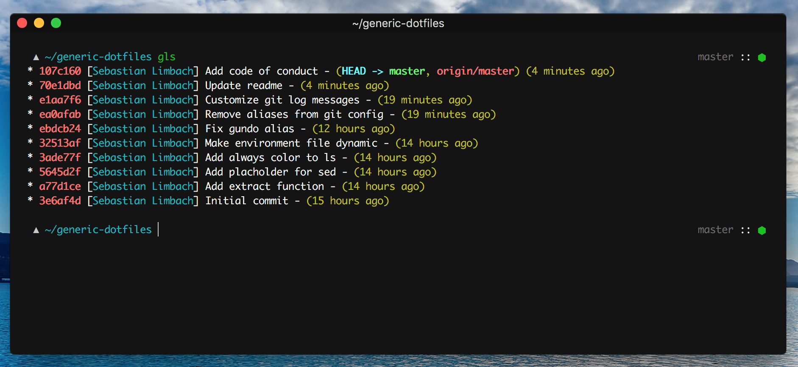

# Dotfiles


Your dotfiles are how you personalize your system. These are mine.
These dotfiles are the bare minimum to provide an environment which I'm comfortable working with.
It should work on **macOS** and **Linux** based systems as well as **GitHub Codespaces**.

Read more about why you should create and share your dotfiles on "[GitHub does dotfiles](https://dotfiles.github.io/)".

# Installation
**Disclaimer:** If you want to give these dotfiles a try, you should first **fork this repository**, review the code, and remove things you don’t want or need. Don’t blindly use my settings unless you know what that entails. *Use at your own risk!*

**Install [zsh](https://zsh.sourceforge.io/) and make it your default shell**
```bash
brew install zsh # or with any other package manager
chsh -s /bin/zsh # get the path to zsh using 'which zsh'
```

**Download & install the dotfiles**
```bash
git clone https://github.com/bastilimbach/dotfiles.git ~/.dotfiles && cd ~/.dotfiles && ./install
```

# Contribution
I really appreciate every contribution, but these are my personal dotfiles which I use on every machine I own. So there is a good chance, that I might not merge your PR because I don't need that `feature/fix/improvement`.

Please note that this project is released with a [Contributor Code of Conduct](https://github.com/bastilimbach/dotfiles/blob/master/CODE_OF_CONDUCT.md). By participating in this project you agree to abide by its terms.

# License
[MIT](https://github.com/bastilimbach/dotfiles/blob/master/LICENSE) :heart:
